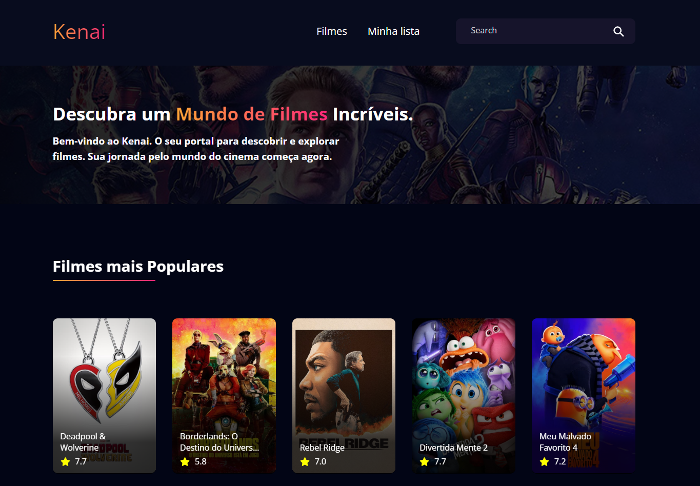

	<h1>Kenai 🎬🍿</h1>
	
	 
	 
	

	   $\color{DeepPink}{\textsf{Kenai}}$ é uma plataforma interativa desenvolvida para os $\color{DarkOrange}{\textsf{amantes de cinema}}$, permitindo que os usuários descubram novos filmes, oferecendo $\color{DeepPink}{\textsf{detalhes completos}}$ sobre cada um, como elenco e trailers. Além disso, os usuários podem criar uma $\color{DarkOrange}{\textsf{coleção personalizada}}$ de seus filmes preferidos.
	

 

<h2 id="functionalities">⚙ Funcionalidades</h2>

- [x] Filmes mais populares no momento.
- [x] Filmes em cartaz no cinema.
- [x] Filmes com as melhores avaliações.
- [x] Pesquisar o filme que deseja na barra de busca e visualizar os resultados encontrados.
- [x] Visualizar informações completas do filme, como sinopse, data de lançamento e etc.
- [x] Criar lista personalizada com seus filmes preferidos.

<h2>💻 Tecnologias</h2>
<ul>
	<li>ReactJS</li>
	<li>SASS/SCSS</li>
	<li>React Router</li>
	<li>Context API</li>
	<li>Vite</li>
</ul>

<h2>🚀 Rodando Localmente</h2>
Para executar o projeto, siga-os passos abaixo:

<h3>Clone o projeto</h3>
<pre>git clone https://github.com/gabrielalencs/Kenai-Movies.git</pre>

<h3>Instale as dependências</h3>
<pre>npm install</pre>

<h3>Execute a aplicação</h3>
<pre>npm run dev</pre>

<h2>🎯 Deploy</h2>

Para o deploy do projeto, utilizei a <b>Vercel</b>. Você pode visualizar a página <a href="https://kenai-movies-company.vercel.app/">Clicando Aqui</a>.

 

  
Desenvolvido com 🧡 por <b>Gabriel de Alencar</b>

